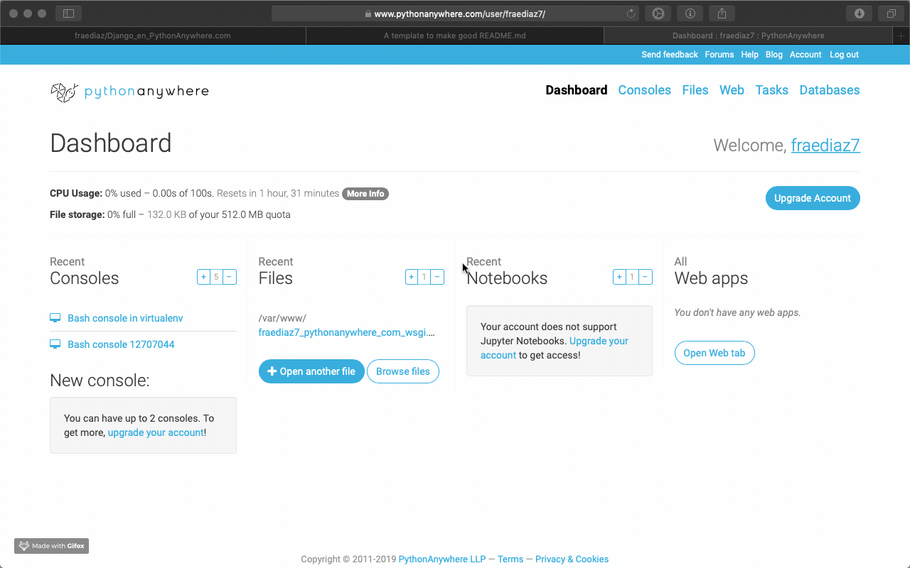

# Proyecto Django 2.2 + PythonAnywhere.com
Una alternativa sólida a otros VPS.


## Cómo comenzar ?

Para este ejemplo, usaremos la configuración manual del servidor, aún no hay soporte para Django2.2.

Vamos a necesitar Github para mover el proyecto, y un entorno virtual para Python 3.7.

### Pre-Requisitos

Dentro de https://pythonanywhere.com y con la cuenta gratuita configurada; haremos lo siguiente. 



https://www.youtube.com/watch?v=Ix942KTE54A
```
 >  Aplicaciones Webs
 >  Nueva App
 >  Configuración Manual
 >  Python 3.7
```

## Instalación Local

Podemos hacerlo directamente en el servidor, pero en este ejemplo crearemos el proyecto de forma local, y luego con Github lo clonaremos a la nube.

```
 $ virtualenv --python=python3.7 venv
 $ source venv/bin/activate
 (venv)$ pip install django
 (venv)$ django-admin startproyect Proyecto

```

Con lo anterior, tenemos un proyecto Django2.2 bajo un entorno virtual de Python3.7

Debemos configurar el archivo settings.py
Cambiar las siguiente lineas.
```
ALLOWED_HOSTS = ['fraediaz7.pythonanywhere.com','localhost']
LANGUAGE_CODE = 'es-cl'
```

Mi host corresponde a 'fraediaz7', deben cambiar según su dominio.
Para correrlo localmente, incluyo 'localhost'

```
(venv)$ cd Proyecto/
(venv)$ python manage.py runserver 0:80

```
Si todo marcha bien, podrán verlo correr en http://localhot


### Subir el proyecto a Github.

Suben el proyecto configurado previamente a su cuenta, lo demás se hace en el servidor.


### En Pythonanywhere.com

En el apartado Consolas, entraremos a un terminal $BASH, crearemos un entorno virtual e instalaremos Django. (Recordar que es el modo de configuración manual)

```
$ virtualenv --python=python3.7 venv
$ source venv/bin/activate
(venv)$ pip install django

```

## Finalmente

Add additional notes about how to deploy this on a live system

## Built With

* [Dropwizard](http://www.dropwizard.io/1.0.2/docs/) - The web framework used
* [Maven](https://maven.apache.org/) - Dependency Management
* [ROME](https://rometools.github.io/rome/) - Used to generate RSS Feeds

## Contributing

Please read [CONTRIBUTING.md](https://gist.github.com/PurpleBooth/b24679402957c63ec426) for details on our code of conduct, and the process for submitting pull requests to us.

## Versioning

We use [SemVer](http://semver.org/) for versioning. For the versions available, see the [tags on this repository](https://github.com/your/project/tags). 

## Authors

* **Billie Thompson** - *Initial work* - [PurpleBooth](https://github.com/PurpleBooth)

See also the list of [contributors](https://github.com/your/project/contributors) who participated in this project.

## License

This project is licensed under the MIT License - see the [LICENSE.md](LICENSE.md) file for details

## Acknowledgments

* Hat tip to anyone whose code was used
* Inspiration
* etc
