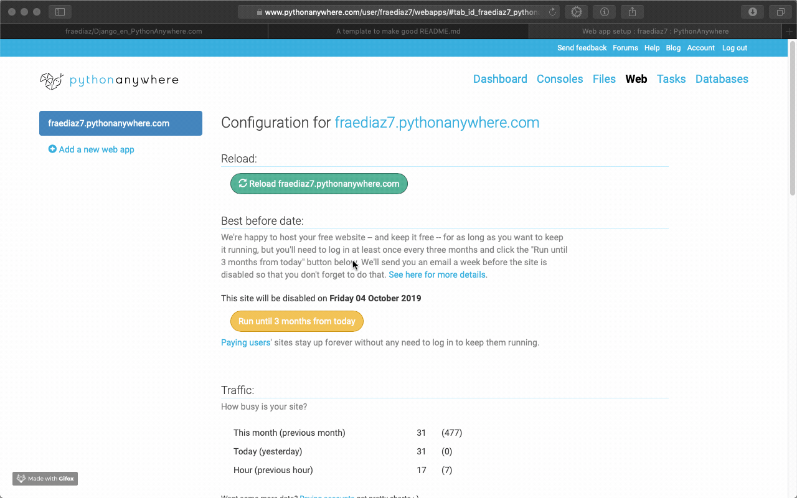

# Proyecto Django 2.2 + PythonAnywhere.com
Una alternativa sólida a otros VPS.


## Cómo comenzar ?

Para este ejemplo, usaremos la configuración manual del servidor, aún no hay soporte para Django2.2.

Vamos a necesitar Github para mover el proyecto, y un entorno virtual para Python 3.7.

### Pre-Requisitos

Dentro de https://pythonanywhere.com y con la cuenta gratuita configurada; haremos lo siguiente. 


```
 >  Aplicaciones Webs
 >  Nueva App
 >  Configuración Manual
 >  Python 3.7
```

## Instalación Local

Podemos hacerlo directamente en el servidor, pero en este ejemplo crearemos el proyecto de forma local, y luego con Github lo clonaremos a la nube.

```
 $ virtualenv --python=python3.7 venv
 $ source venv/bin/activate
 (venv)$ pip install django
 (venv)$ django-admin startproyect Proyecto

```

Con lo anterior, tenemos un proyecto Django2.2 bajo un entorno virtual de Python3.7

Debemos configurar el archivo settings.py
Cambiar las siguiente lineas.
```
ALLOWED_HOSTS = ['fraediaz7.pythonanywhere.com','localhost']
LANGUAGE_CODE = 'es-cl'
```

Mi host corresponde a 'fraediaz7', deben cambiar según su dominio.
Para correrlo localmente, incluyo 'localhost'

```
(venv)$ cd Proyecto/
(venv)$ python manage.py runserver 0:80

```
Si todo marcha bien, podrán verlo correr en http://localhot


### Subir el proyecto a Github.

Suben el proyecto configurado previamente a su cuenta, lo demás se hace en el servidor.


### En Pythonanywhere.com

En el apartado Consolas, entraremos a un terminal $BASH, crearemos un entorno virtual e instalaremos Django. (Recordar que es el modo de configuración manual).


```
$ virtualenv --python=python3.7 venv
$ source venv/bin/activate
(venv)$ pip install django

```
Sin salir de la terminal, clonamos nuestro proyecto desde Github

```

(venv)$ git clone https://github.com/fraediaz/Django_en_PythonAnywhere.com.git

```

Ahora tenemos un entorno virtual con django y nuestro proyecto en la nube.

## Finalmente

Configuramos las variables de la aplicación web.

```
Source code:
/home/fraediaz7/Django_en_PythonAnywhere.com/Proyecto/

Virtualenv
/home/fraediaz7/venv
```

Reemplazemos todo el texto de /var/www/fraediaz7_pythonanywhere_com_wsgi.py.
En Code>WSGI configuration file:

Pega este código, recuerda reemplazar rutas y variables según corresponda en tu propio proyecto.

```

import os
import sys

path = '/home/fraediaz7/Django_en_PythonAnywhere.com/Proyecto'
if path not in sys.path:
    sys.path.insert(0, path)

os.environ['DJANGO_SETTINGS_MODULE'] = 'Proyecto.settings'

from django.core.wsgi import get_wsgi_application
application = get_wsgi_application()

```


## Reoad a la Aplicación y automágicamente; Listo!



## Autor

* **Franco Díaz** - *Python Developer* - [@fraediaz](https://github.com/fraediaz)
